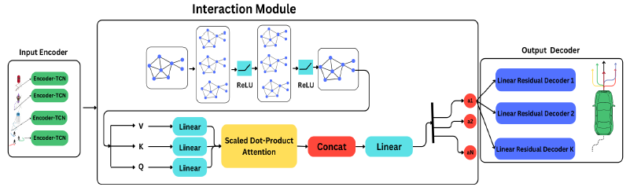

# Tcrat_pred: Multi-Agents Trajectory Prediction for Autonomous Vehicles with Multi-Modal Predictions 

This repository contains the official implementation of **Tcrat_pred**, an extended version of **CRAT-Pred** (Schmidt et al., ICRA 2022) adapted for the **Argoverse 2 Motion Forecasting Dataset**.  
The work was developed as part of the MSc thesis of **Mohammad Alghazawi** at the **University of Debrecen** and published at the **2024 IEEE 15th International Conference on Cognitive Infocommunications (CogInfoCom)**.

---

## 📑 Table of Contents

1. [Publication Details](#-publication-details)  
2. [Abstract](#-abstract)  
3. [Keywords](#-keywords)  
4. [Results Summary](#-results-summary)  
5. [Model Architecture](#-model-architecture)  
6. [Citation](#-citation) 
7. [License](#-license)  
8. [Repository Structure](#-repository-structure)  
9. [Installation](#️-installation)  
10. [Dataset Setup](#-dataset-setup)  
11. [Training & Evaluation](#-training--evaluation) 
12. [Logging & Visualization](#-logging--visualization)

---

## 📖 Publication Details

- **Title:** Tcrat_pred: Multi-Agents Trajectory Prediction for Autonomous Vehicles with Multi-Modal Predictions  
- **Authors:** Husam A. Neamah; Mohammad Alghazawi; Peter Korondi  
- **Conference:** IEEE 15th International Conference on Cognitive Infocommunications (CogInfoCom 2024)  
- **Location:** Hachioji, Tokyo, Japan  
- **Date:** 16–18 September 2024  
- **Publisher:** IEEE  
- **DOI:** [10.1109/CogInfoCom63007.2024.10894711](https://doi.org/10.1109/CogInfoCom63007.2024.10894711)  
- **IEEE Xplore:** [Link to paper](https://ieeexplore.ieee.org/document/10894711)  
- **ResearchGate:** [Link to publication](https://www.researchgate.net/publication/389305542_Multi-Agents_Trajectory_Prediction_for_Autonomous_Vehicles_with_Multi-Modal_Predictions)  
- **Date Added to IEEE Xplore:** 24 February 2025  

---

## 📝 Abstract

**TCRAT-Pred** enhances the CRAT-Pred framework by replacing LSTMs with **Temporal Convolutional Networks (TCNs)** and integrating graph-based interaction modeling. This design improves both **accuracy** and **computational efficiency** in predicting the trajectories of vehicles and pedestrians.  
Experiments on the **Argoverse 2 dataset** show that TCRAT-Pred achieves **lower error metrics, faster training times, and fewer parameters** compared to state-of-the-art baselines.  

👉 *For full methodology, experiments, and discussion, please refer to the [IEEE paper](https://ieeexplore.ieee.org/document/10894711).* 

---

## 🔑 Keywords

- **IEEE Keywords:** Training, Pedestrians, Computational modeling, Predictive models, Benchmark testing, Trajectory, Computational efficiency, Convolutional neural networks, Autonomous vehicles, Long short-term memory  
- **Index Terms:** Autonomous Vehicles, Trajectory Prediction, Multimodal Prediction, Neural Network, Convolutional Neural Network, Computational Efficiency, Long Short-term Memory, Pedestrian, Computational Speed, Vehicle Motion, Temporal Convolutional Network, Forecasting, Graph Neural Networks, Agent Interactions  
- **Author Keywords:** autonomous driving, motion prediction, Temporal Convolutional Network (TCN), multi-agents, multi-modal  

---

## 📊 Results Summary

Experiments on the **Argoverse 2 Motion Forecasting Dataset** show that **TCRAT-Pred** outperforms baselines and state-of-the-art models:

| Method       | minADE | minFDE (k=1) | MR   | minADE (k=6) | minFDE (k=6) | MR   |
|--------------|--------|--------------|------|---------------|---------------|------|
| Const. Vel.  | 7.75   | 17.44        | 0.89 | N/A           | N/A           | N/A  |
| NN           | 4.46   | 11.71        | 0.81 | 2.18          | 4.94          | 0.60 |
| LSTM         | 3.05   | 8.28         | 0.85 | N/A           | N/A           | N/A  |
| CRAT-Pred    | 2.44   | 6.40         | 0.75 | 1.29          | 2.76          | 0.42 |
| **Ours**     | **2.40** | **6.32**   | **0.73** | **1.28**  | **2.73**      | **0.40** |

- **Training time:** 14.22 hours (vs. 1.019 days for CRAT-Pred)  
- **Parameters:** 527K (vs. 561K for CRAT-Pred)  
- **Model size:** 2.111 MB (vs. 2.245 MB for CRAT-Pred)  

---

## 🏗️ Model Architecture

The **TCRAT-Pred** framework consists of three main components:

1. **Input Encoder (TCNs)** – encodes agent trajectories with efficient temporal modeling.  
2. **Interaction Module (Graph + Attention)** – captures dependencies between agents using graph neural networks and scaled dot-product attention.  
3. **Output Decoder (Residual Multi-Modal Decoders)** – generates multiple possible future trajectories with residual connections for stability.  

<p align="center">
  
</p>

👉 *See the [IEEE paper](https://ieeexplore.ieee.org/document/10894711) for full architectural details and analysis.*  

---

## 📌 Citation 

If you use this repository, please cite:

```bibtex
@InProceedings{alghazawi2024tcratpred,
  author    = {Husam A. Neamah and Mohammad Alghazawi and Peter Korondi},
  title     = {Tcrat_pred: Multi-Agents Trajectory Prediction for Autonomous Vehicles with Multi-Modal Predictions},
  booktitle = {2024 IEEE 15th International Conference on Cognitive Infocommunications (CogInfoCom)},
  year      = {2024},
  pages     = {1--7},
  doi       = {10.1109/CogInfoCom63007.2024.10894711}
}
```
For reference, the original CRAT-Pred citation is:

```bibtex
@InProceedings{schmidt2022cratpred,
  author    = {Julian Schmidt and Julian Jordan and Franz Gritschneder and Klaus Dietmayer},
  title     = {CRAT-Pred: Vehicle Trajectory Prediction with Crystal Graph Convolutional Neural Networks and Multi-Head Self-Attention},
  booktitle = {2022 IEEE International Conference on Robotics and Automation (ICRA)},
  year      = {2022},
  pages     = {7799--7805}
}
```
---

## 📜 License
This project builds upon CRAT-Pred, which is licensed under [the Creative Commons Attribution-NonCommercial 4.0 International License](). See the [LICENSE](LICENSE)  file for details.

---

## 📂 Repository Structure
``` code 
tcrat-pred/
│── data/
│   └── argoverse/
│       ├── utils/
│       │   ├── extractor_proc.py
│       │   ├── torch_utils.py
│       │── argo_csv_dataset.py
│── images/
│   └── model_overview.png
│
│── model/
│   └── tcrat_pred.py
│
│── dataset/
│   └── argoverse2/   # created by fetch_dataset.sh
│
│── fetch_dataset.sh
│── preprocess.py
│── train_Tcrat_Pred.py
│── test_Tcrat_Pred.py
│── environment.yml
│── LICENSE
│── README.md
```
---

## ⚙️ Installation
We recommend using conda to create a reproducible environment.

```bash
git clone https://github.com/mohammad-alghazawi/tcrat-pred.git
cd tcrat-pred
conda env create -f environment.yml
conda activate tcrat-pred
```
- **Python:** 3.8   
- **PyTorch:** 1.11.0 (CUDA 11.3, cuDNN 8.2)
- **PyTorch Geometric:** 2.0.4
- **PyTorch Lightning:** 1.5.10   

---

## 📂 Dataset Setup
Download and extract the Argoverse 2 Motion Forecasting Dataset:

```bash
bash fetch_dataset.sh
```

This creates:

```code
dataset/
  └── argoverse2/
      ├── train/
      ├── val/
      └── map_files/
```
**Note**: The test split is private and only available via the official Argoverse leaderboard.

---

## 🚀 Training & Evaluation
### Training

```bash 
python3 train_Tcrat_Pred.py 
```
or
```bash
python3 train_Tcrat_Pred.py --use_preprocessed=True
```
### Evaluation
```bash
python3 test_Tcrat_Pred.py --weight= checkpoints/best_model.ckpt --split= test / val
```
### Preprocessing
```bash
python3 preprocess.py --data_dir dataset/argoverse2
```
---
## 📊 Logging & Visualization
Training progress and metrics are logged with TensorBoard:

```bash 
tensorboard --logdir lightning_logs/
```
Navigating to http://localhost:6006/ opens Tensorboard.

